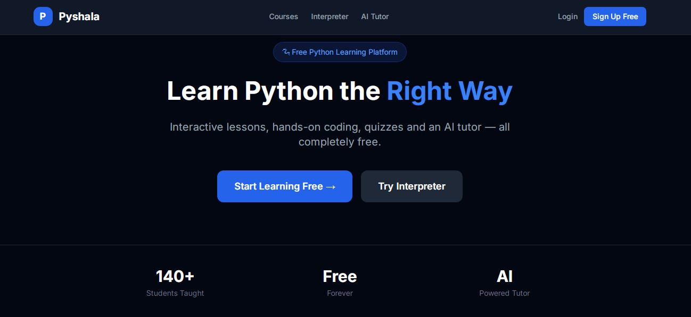
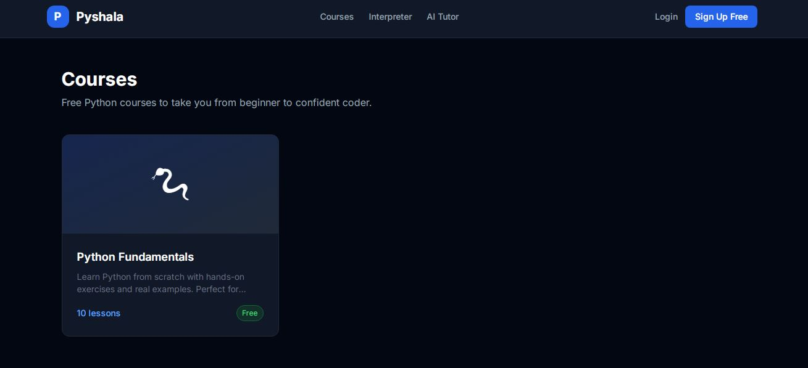
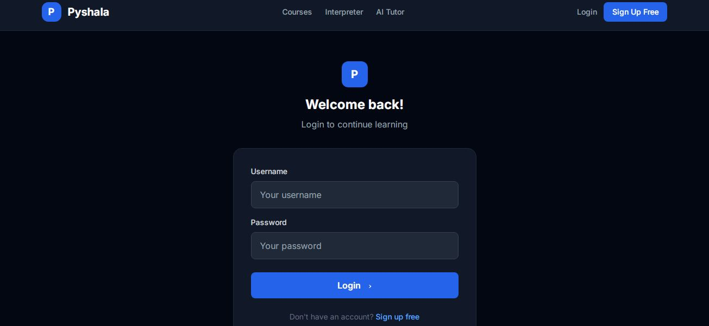
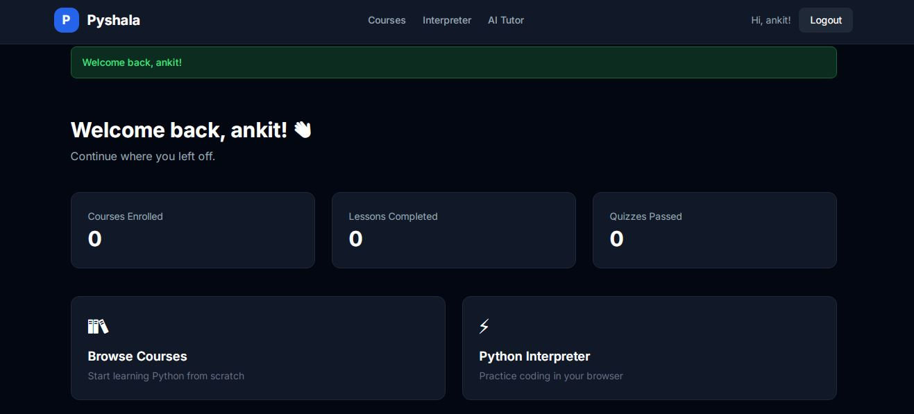
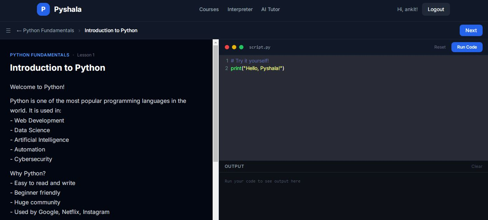

# 🧪 PyShala – Secure Python Execution Platform

🌐 **Live Demo:** https://www.pyshala.in  

A security-focused platform for learning Python with **sandboxed code execution and protection against malicious inputs**.

---

## 🚀 Overview

PyShala allows users to write and execute Python code in an interactive environment while ensuring **safe and controlled execution**.

The system is designed using **real-world cybersecurity principles** to prevent misuse and attacks.

---

## ⚙️ How It Works  

1. User submits Python code via the web interface  
2. Input is validated and sanitized  
3. Code is executed in a restricted sandbox environment  
4. Security checks prevent unsafe operations  
5. Output is safely returned to the user  

---

## 🏗️ System Architecture  

The platform follows a modular and secure architecture:

1. **Frontend Layer**
   - User interface for learning, coding, and interaction  
   - Handles user input and displays results  

2. **Backend Layer**
   - Processes user requests  
   - Manages authentication and business logic  

3. **Code Execution Engine**
   - Executes user-submitted Python code in a controlled environment  
   - Applies security restrictions to prevent misuse  

4. **Security Layer**
   - Input validation and sanitization  
   - Protection against XSS, SQL Injection, and code injection  
   - Basic safeguards against resource abuse  

5. **CI/CD Pipeline**
   - Automates build and deployment process  
   - Ensures consistent and reliable releases

6. ## 🔐 Infrastructure Security Enhancements  

- Implemented secure HTTP headers via Nginx (CSP, HSTS, X-Frame-Options, Permissions-Policy) achieving A-grade security rating  
- Configured Fail2Ban for SSH brute-force protection with automated IP banning  
- Applied rate limiting on authentication endpoints to prevent abuse and brute-force attacks  
- Enabled AWS CloudTrail for audit logging and monitoring of API activity  
- Performed security scanning using Nmap and Nikto with no critical vulnerabilities identified  
- Conducted static application security testing (SAST) using Bandit with zero high/medium severity issues  

7. **Cloud Deployment**
   - Hosted on cloud infrastructure (AWS)  
   - Scalable and accessible over the internet  

---

### 🔄 Request Flow  

User → Frontend → Backend → Execution Engine → Output  
                         ↓  
                    Security Layer  
                         ↓  
                     AWS Cloud  
                         ↓  
                    CI/CD Pipeline  

---

## 🔐 Infrastructure Security Enhancements  

- Fail2Ban configured for SSH brute-force protection  
- Secure HTTP headers implemented via Nginx (Grade A)  
- Rate limiting applied to authentication endpoints  
- Django security best practices enforced  
- AWS CloudTrail enabled for audit logging

---

## 🛡️ Security Features

* Secure deployment with HTTPS enabled
* Sandboxed execution environment for untrusted code
* Input validation and sanitization to prevent injection attacks  
* Restricted access to system-level resources  
* Execution time and resource limits  
* Protection against XSS, SQL Injection, and code injection  

---

## ⚠️ Threat Model

This platform considers and mitigates the following threats:

* Malicious Python code execution  
* Unauthorized file/system access  
* Infinite loop / resource exhaustion (DoS)  
* Injection-based attacks (SQL Injection, XSS)  
* Abuse of execution environment  

---

## ⚙️ CI/CD Pipeline  

- Designed and implemented CI/CD pipeline for automated build and deployment  
- Streamlined code integration and release process  
- Ensured consistent and reliable deployments to cloud environment  
- Foundation for integrating security checks (DevSecOps)  

---

## 🧪 Security Testing

The platform has been actively tested against real-world attack scenarios:

* SQL Injection (Union, Blind, Time-based)  
* Cross-Site Scripting (XSS)  
* Command & Code Injection  
* Unauthorized file access attempts  
* Infinite loop / Denial-of-Service (DoS)  

Testing is ongoing to continuously improve system security.

---

## 🛡️ Security Background

This project is built using practical knowledge of cybersecurity concepts:

* SQL Injection  
* Cross-Site Scripting (XSS)  
* Command Injection  
* DoS attack techniques  

Experience with tools:

* Burp Suite  
* OWASP ZAP  
* Nmap  
* Wireshark  
* Metasploit  

---

## 🧠 Core Features

* Interactive coding environment  
* YAML-based modular lessons  
* Automated test case validation  
* Structured learning system  

---

## ⚙️ Tech Stack

* Python  
* Reflex Framework  
* Monaco Editor  
* YAML  

---

## 📸 Project Screenshots  

<p align="center">
  
  
</p>

<p align="center">
  
  
</p>

<p align="center">
  
</p>

---

## 🛠️ Setup Instructions

```bash
git clone https://github.com/halbeadi/pyshala.git
cd pyshala
pip install -r requirements.txt
python app.py
