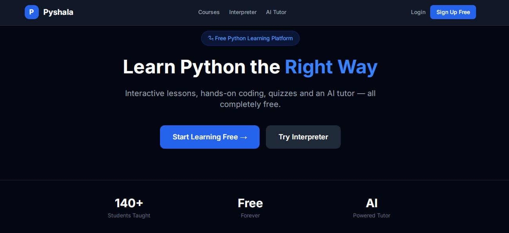
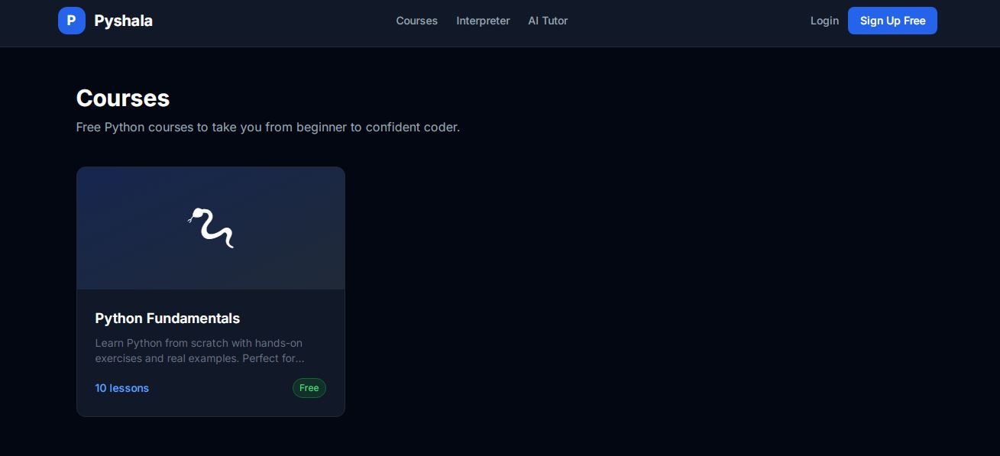
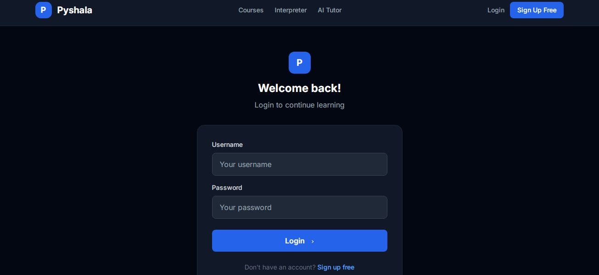
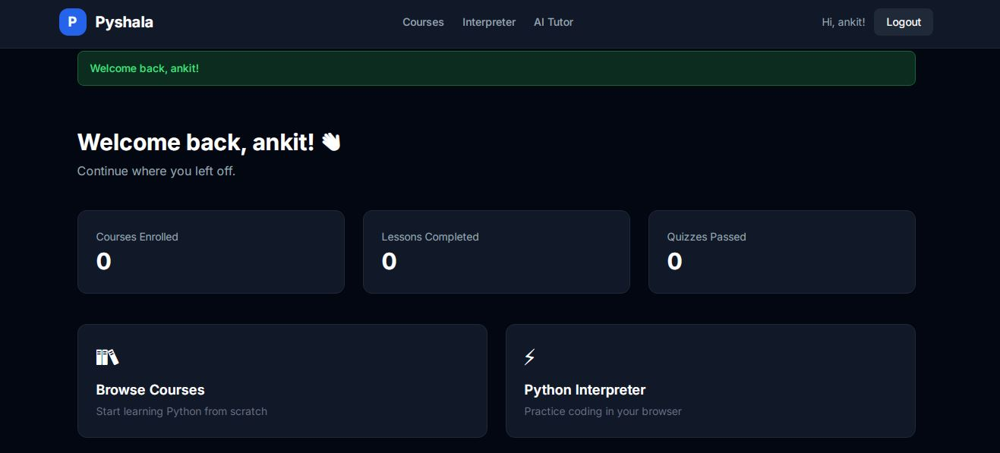
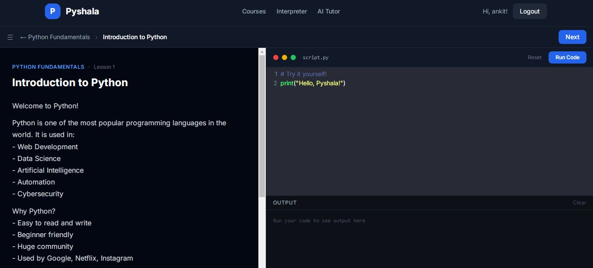

# 🛡️ Pyshala – Secure Python Learning Platform

🌐 **Live:** https://www.pyshala.in | **Stack:** Django · AWS EC2 · Nginx · PostgreSQL · GitHub Actions

A production-grade Python learning platform built with security-first principles — featuring sandboxed code execution, DevSecOps CI/CD, and container security hardening.

---

## 🔐 Security Highlights

| Area | Implementation |
|---|---|
| Container Security | Hardened Dockerfile (non-root user, slim base image) |
| Vulnerability Scanning | Trivy image scan in CI/CD — fixed 2 HIGH Django CVEs |
| SAST | Bandit static analysis on every push |
| Web Headers | Nginx security headers — Grade A (securityheaders.com) |
| Brute Force Protection | Fail2Ban with automated IP banning |
| Audit Logging | AWS CloudTrail enabled |
| Rate Limiting | Applied to authentication endpoints |
| HTTPS | Enforced via Nginx + SSL |

---

## 🏗️ Architecture

User → Nginx (HTTPS + Security Headers)
↓
Gunicorn (Django App)
↓
PostgreSQL Database
↓
GitHub Actions CI/CD
(Bandit SAST + Trivy Container Scan + Deploy)

---

## 🐳 Docker Security Hardening

### What was found (before hardening)
Running Trivy against the original image found **50 HIGH severity vulnerabilities**:
- 2 HIGH CVEs in Django 6.0.3 (DoS + header spoofing) — **status: fixed**
- 48 OS-level CVEs in linux-libc-dev, ncurses, systemd — status: affected (no upstream fix)

### What was fixed
- Upgraded Django 6.0.3 → **6.0.4** (patched both CVEs)
- Added **non-root user** (`appuser`) — container no longer runs as root
- Used `python:3.12-slim` base image to minimize attack surface
- Used `--no-cache-dir` to avoid leaving pip cache in image
- Used `--chown` on COPY to ensure correct file ownership

### After hardening

Total: 48 (HIGH: 48, CRITICAL: 0)
Django CVEs: 0 (both fixed)
Running as root: No

---

## ⚙️ CI/CD Pipeline

Every push to `main` triggers:

1. **Bandit SAST** — scans Python code for security issues
2. **Trivy container scan** — scans Docker image for HIGH/CRITICAL CVEs
3. **Automated deployment** to AWS EC2

---

## 🧪 Security Testing

Actively tested against:
- SQL Injection (Union, Blind, Time-based)
- Cross-Site Scripting (XSS)
- Command & Code Injection
- Brute-force attacks
- Denial-of-Service (resource exhaustion)

Tools used: Burp Suite, OWASP ZAP, Nmap, Bandit, Trivy

---

## 🧠 Core Features

- Codecademy-style split-screen lesson layout
- Django-backend sandboxed Python code runner
- Quiz system with automated validation
- AI-powered tutor (Claude API)
- YAML-based modular lesson structure

---

## ⚙️ Tech Stack

- **Backend:** Python, Django, Gunicorn
- **Database:** PostgreSQL
- **Web Server:** Nginx
- **Cloud:** AWS EC2, S3, IAM, CloudTrail
- **CI/CD:** GitHub Actions
- **Security:** Bandit, Trivy, Fail2Ban, OWASP ZAP

---

## 📸 Screenshots

<p align="center">
  
  
</p>

<p align="center">
  
  
</p>

<p align="center">
  
</p>

---

## 🛠️ Local Setup

```bash
git clone https://github.com/halbeadi/pyshala.git
cd pyshala/pyshala
pip install -r requirements.txt
python manage.py runserver
```
